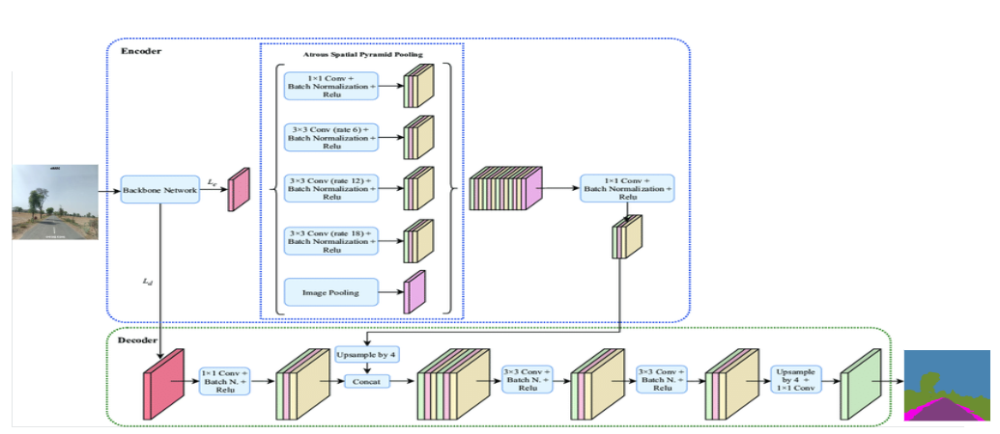
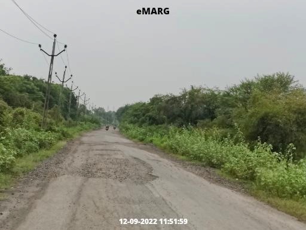
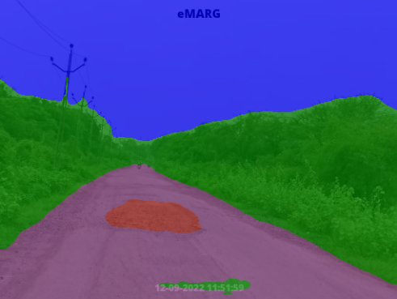
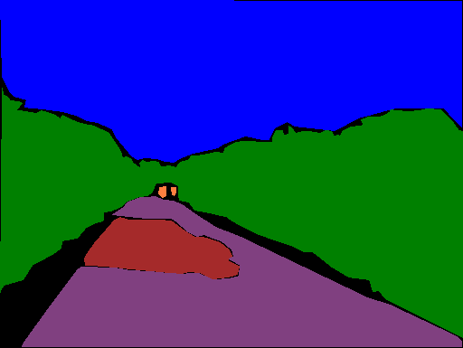

# "eMARG" Automatic Road Quality Inspection

We have used DeepLabv3+ semantic segmentation model trained on eMARG-15k images(Good/Bad).

## Quick Start 

### 1. Available Architectures
Specify the model architecture with '--model ARCH_NAME' and set the output stride using '--output_stride OUTPUT_STRIDE'.

<p float="left">
 
  
</p>

| DeepLabV3    |  DeepLabV3+        |
| :---: | :---:     |
|deeplabv3_resnet50|deeplabv3plus_resnet50|
|deeplabv3_resnet101|deeplabv3plus_resnet101|
|deeplabv3_mobilenet|deeplabv3plus_mobilenet ||
|deeplabv3_hrnetv2_48 | deeplabv3plus_hrnetv2_48 |
|deeplabv3_hrnetv2_32 | deeplabv3plus_hrnetv2_32 |

### All pretrained model checkpoints: [Drive](https://drive.google.com/drive/folders/1jA0iS7hq-AmFBtSn0Ne9DvIxcXCQBQGG?usp=drive_link)

### 2. Load the pretrained model:
```python
model.load_state_dict( torch.load( CKPT_PATH )['model_state']  )
```
### 3. Visualize segmentation outputs:
```python
outputs = model(images)
preds = outputs.max(1)[1].detach().cpu().numpy()
colorized_preds = val_dst.decode_target(preds).astype('uint8') # To RGB images, (N, H, W, 3), ranged 0~255, numpy array
# Do whatever you like here with the colorized segmentation maps
colorized_preds = Image.fromarray(colorized_preds[0]) # to PIL Image
```

### 4. Prediction
Single image:
```bash
python predict.py --input datasets/data/eMARG/leftImg8bit/train/city0/PE-AR-7382-157_2_leftImg8bit  --dataset cityscapes --model deeplabv3plus_mobilenet --ckpt checkpoints/best_deeplabv3plus_mobilenet_cityscapes_os16.pth --save_val_results_to test_results
```

Image folder:
```bash
python predict.py --input datasets/data/eMARG/leftImg8bit/train/city0  --dataset cityscapes --model deeplabv3plus_mobilenet --ckpt checkpoints/best_deeplabv3plus_mobilenet_cityscapes_os16.pth --save_val_results_to test_results
```

## Results

### 1. Performance on eMARG (6 classes, 512 x 384)

Training: 768x768 random crop  
validation: 512x384

|  Model          | Batch Size  | mIoU  | Overall_Accuracy   |  Mean_Accuracy |lr |checkpoint_link   |
| :--------        | :-------------: | :----:   | :-----------: | :--------: | :--------: |  :----:   |
| DeepLabV3Plus-MobileNet   | 4      |  0.558     |  0.896   |  0.694  |  0.01 | [Download](https://drive.google.com/file/d/1pAFgtqZe1otNwDeAOxZeKxy6Hjrdjhbs/view?usp=sharing)
| DeepLabV3Plus-ResNet101   | 4      |  0.600   |  0.854   |  0.741  | 0.01 | [Download](https://drive.google.com/file/d/1pAFgtqZe1otNwDeAOxZeKxy6Hjrdjhbs/view?usp=sharing)


#### Segmentation Results on Cityscapes (DeepLabv3Plus-MobileNet)

<p float="left">
  
   
  
  
  
</p>


## eMARG Dataset
### 1. Requirements

```bash
pip install -r requirements.txt
```


### 2. Download eMARG and extract it likewise Cityscapes dataset in this format 'datasets/data/cityscapes'

```
/datasets
    /data
        /eMARG
            /gtFine
            /leftImg8bit
```

### 3. Train your model on eMARG likewise Cityscapes.

```bash
python main.py --model deeplabv3plus_mobilenet --dataset cityscapes --enable_vis --vis_port 28333 --gpu_id 0  --lr 0.1  --crop_size 768 --batch_size 16 --output_stride 16 --data_root ./datasets/data/eMARG
python main.py --model deeplabv3plus_resnet101 --dataset cityscapes --enable_vis --vis_port 28333 --gpu_id 0  --lr 0.1  --crop_size 768 --batch_size 16 --output_stride 16 --data_root ./datasets/data/eMARG 
```

#### 4. Testing

Results will be saved at ./results.

```bash
python main.py --model deeplabv3plus_mobilenet --enable_vis --vis_port 28333 --gpu_id 0 --year 2012_aug --crop_val --lr 0.01 --crop_size 513 --batch_size 16 --output_stride 16 --ckpt checkpoints/best_deeplabv3plus_mobilenet_cityscapes_os16.pth --test_only --save_val_results
python main.py --model deeplabv3plus_mobilenet --enable_vis --vis_port 28333 --gpu_id 0 --year 2012_aug --crop_val --lr 0.01 --crop_size 513 --batch_size 16 --output_stride 16 --ckpt checkpoints/best_deeplabv3plus_mobilenet_cityscapes_os16.pth --test_only --save_val_results

```

## Reference

[1] [Rethinking Atrous Convolution for Semantic Image Segmentation](https://arxiv.org/abs/1706.05587)

[2] [Encoder-Decoder with Atrous Separable Convolution for Semantic Image Segmentation](https://arxiv.org/abs/1802.02611)

